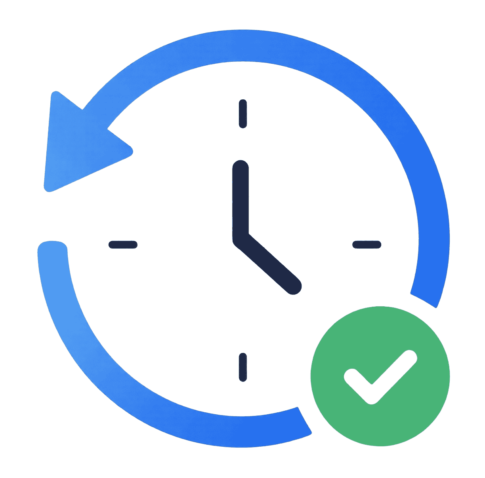
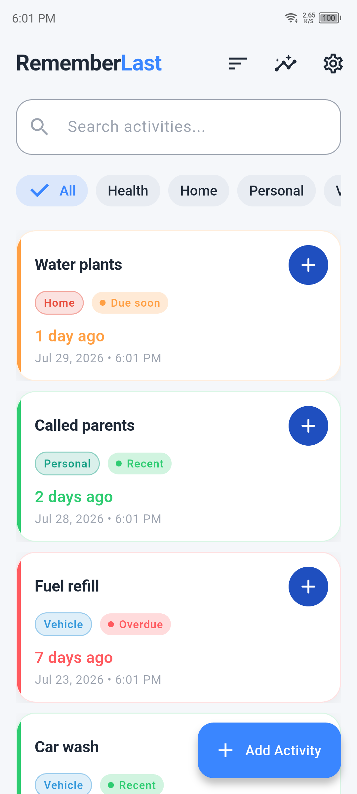
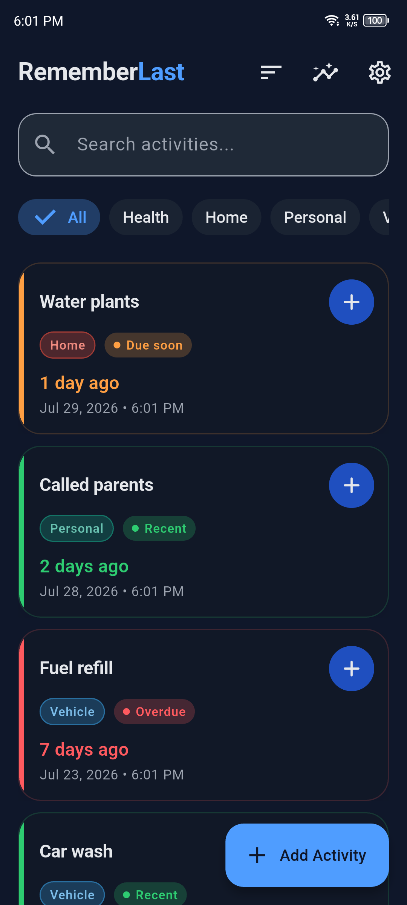
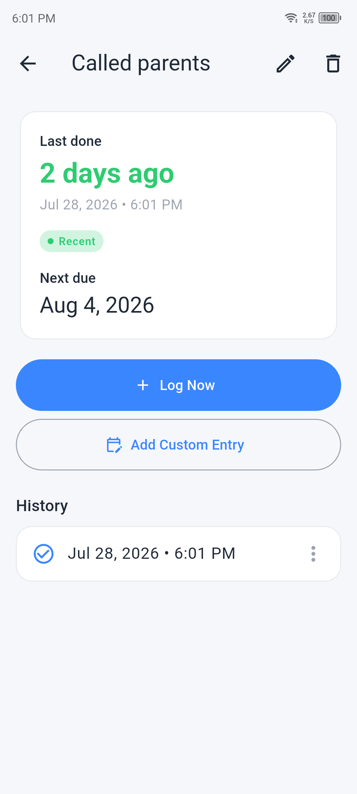
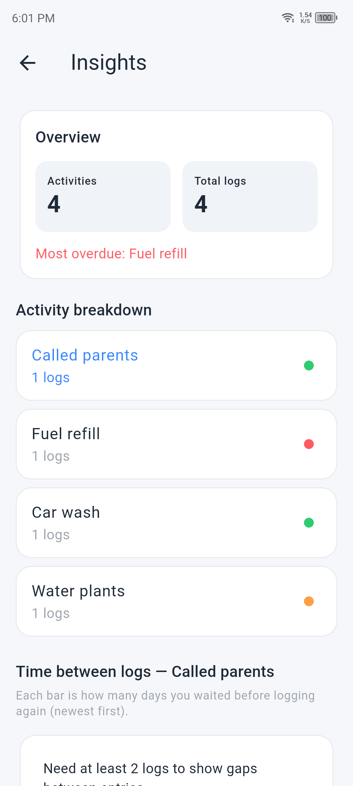

# RememberLast

<p style="text-align: center;">
  
</p>

Offline-first **Last Done Tracker** — remember when you last did anything.

Not a habit tracker. No streaks, no pressure. Just log when you did something and see how long ago it was.

**[Try the live demo](https://dr-usman.github.io/remember_last/)**

## Download

Get RememberLast from Google Play, or download the latest builds for all
supported platforms from GitHub Releases.

<p>
  <a href="https://play.google.com/store/apps/details?id=com.avenzor.remember_last">
    
  </a>
  <a href="https://github.com/Dr-Usman/remember_last/releases/latest">
    
  </a>
</p>

## Screenshots

<p>
  
  
  
  
</p>

## Features

- Track any activity (water plants, car wash, call parents, etc.)
- See **last done time** and **elapsed time** (e.g. "3 days ago")
- Status indicators: Recent / Due soon / Overdue (when reminder is set)
- Quick log from home screen
- Full history per activity with custom backdated entries
- Custom categories (manage from Settings)
- Search, filter by category, sort (recently done, overdue, A–Z)
- Swipe to delete with confirmation
- Insights with average intervals and bar chart
- JSON export/import backup
- Light and dark brand themes (follows system)
- Fully offline — no auth, no analytics

## Tech Stack

- Flutter (Material 3)
- Riverpod (state management)
- Drift (local SQLite database)
- go_router (navigation)
- fl_chart (insights)
- package_info_plus (app version)

## Getting Started

```bash
flutter pub get
dart run build_runner build
flutter run
```

## Project Structure

```
lib/
├── core/           # Constants, database, theme, router, providers, shared widgets
├── features/
│   ├── activities/ # CRUD, home screen, form
│   ├── categories/ # Category management
│   ├── occurrences/# Logging, detail screen, history
│   ├── insights/   # Stats and charts
│   ├── settings/   # Settings, About, privacy policy
│   └── backup/     # JSON export/import
└── bootstrap/      # Seed data on first launch
```

Brand name, store URLs, and privacy URL live in `lib/core/constants/app_constants.dart`.

## Privacy Policy

- **In-app source:** [`docs/privacy_policy.md`](docs/privacy_policy.md) (rendered in Settings → Privacy policy)
- **Hosted page:** https://dr-usman.github.io/remember_last/privacy/
- **Source for the hosted page:** [`web/privacy/index.html`](web/privacy/index.html)

When updating the policy, edit `docs/privacy_policy.md` and sync `web/privacy/index.html`.

CI, PR checks, releasing, GitHub secrets, and Pages setup are documented in [`CONTRIBUTING.md`](CONTRIBUTING.md).

## Regenerate Drift Code

After changing database schema:

```bash
dart run build_runner build
```
